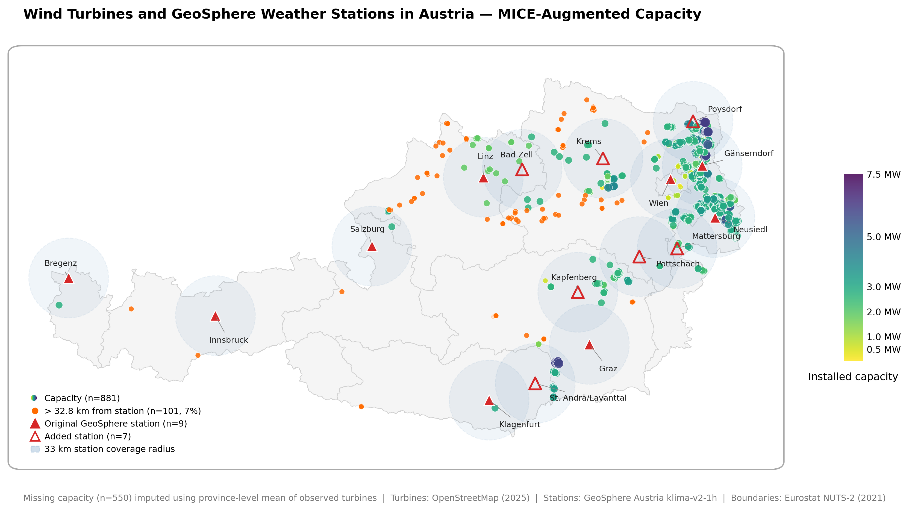
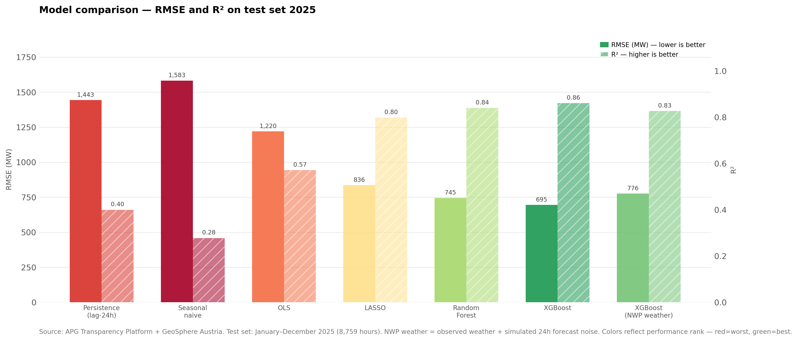
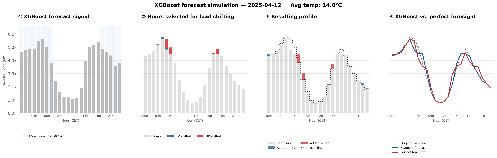
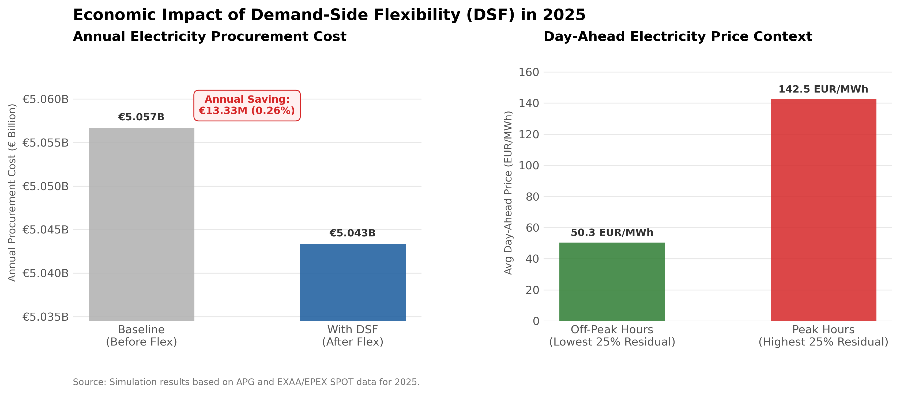
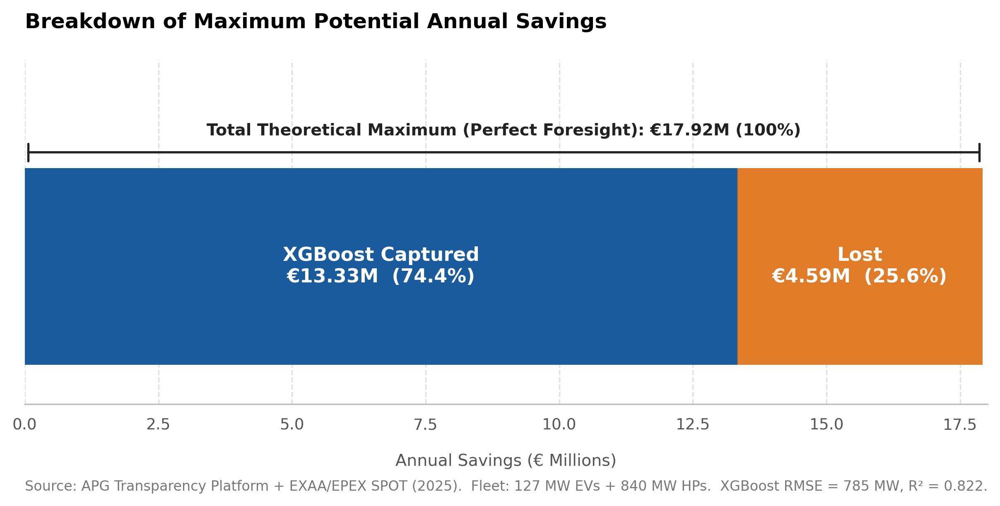

# Forecasting Residual Load and Evaluating Demand-Side Flexibility in the Austrian Electricity Market

## A Public-Data Approach to Reducing Non-Renewable Dependency

**MA Thesis · Economics, Data and Policy (Data Science Track)**  
**Central European University – June 2026**  
**Supervisor: Gábor István Békés**

---

## What this thesis does

Austria's electricity grid is increasingly shaped by wind and solar — but renewable generation follows the weather, not demand. The gap between what renewables produce and what consumers need at any given moment is the **residual load**. When it is unexpectedly high, grid operators activate expensive reserve capacity; when it is unexpectedly low, surplus generation goes to waste. Both outcomes carry costs that grow as renewable penetration increases.

This thesis builds and evaluates a **two-stage framework** for automated demand-side flexibility using exclusively publicly available data:

1. **Forecast** — An XGBoost model trained on three years of Austrian grid and meteorological data predicts hourly residual load 24 hours ahead
2. **Simulate** — A constrained scheduling system uses that forecast to dispatch a fleet of electric vehicles and heat pumps, shifting their load away from peak hours and into surplus hours

A perfect-foresight benchmark establishes the theoretical maximum benefit, allowing forecast-driven results to be evaluated not just in absolute terms but relative to what is physically achievable.

---

## Data

All data are publicly available and fully reproducible:

| Source | Variables | Coverage |
|---|---|---|
| [APG Transparency Platform](https://www.apg.at/transparenz) | Total load, wind, solar, hydro, gas generation; day-ahead & imbalance prices | 2023–2025, hourly |
| [GeoSphere Austria klima-v2-1h](https://data.hub.geosphere.at/) | Temperature, wind speed, global radiation | 16 stations, hourly |
| [OpenStreetMap (Overpass API)](https://overpass-api.de/) | Wind turbine locations and installed capacity | 1,532 turbines |
| Statistik Austria / E-Control | Provincial PV generation (solar weights); population (temperature weights) | 2024 |

---

## Methods

**Spatial aggregation.** Austria's meteorological and energy geography is highly heterogeneous — wind capacity is concentrated in the Pannonian lowlands of the northeast, solar output is spread across flat eastern provinces, and demand is concentrated around Vienna. Three separate weighting schemes convert nine (later sixteen) point station readings into nationally representative composite indices:

- **Temperature** — population-weighted (Statistik Austria 2023)
- **Solar radiation** — provincial PV generation share (Energiebilanz 2024)
- **Wind speed** — turbine-level capacity assignment using Haversine distances in EPSG:31287, with iterative station expansion via DBSCAN clustering of uncovered turbines

*1,532 OSM wind turbines coloured by installed capacity (viridis scale, MW). Missing capacity (n=550) imputed using province-level means via MICE. Orange: turbines >32.8 km from the nearest GeoSphere station. Blue circles: 33 km station coverage radius. Red triangles: original 9 GeoSphere stations; open triangles: 7 added stations. Capacity is heavily concentrated in the Lower Austria–Burgenland corridor, motivating the capacity-weighted wind composite.*

**Forecasting.** A systematic model progression from naive benchmarks (persistence, seasonal naive) through OLS and LASSO to Random Forest and XGBoost isolates the contribution of each modeling choice. The final model uses 17 features across five groups: calendar, lag, weather composites, market signals, and renewable generation lags. To reflect operational conditions where observed weather is unavailable, Gaussian noise calibrated to ECMWF 24h forecast errors is injected during both training and evaluation.

*RMSE (MW, solid bars, left axis) and R² (hatched bars, right axis) across all models on the 2025 test set (8,759 hours). Each step — adding lag memory, allowing nonlinearity, switching to ensemble learning, and re-training under simulated NWP forecast noise — produces a distinct improvement. The chosen model (XGBoost NWP weather) is evaluated under operationally realistic conditions.*

**Flexibility simulation.** 191,185 eligible EVs (home/workplace chargers, 73% of registered fleet) and 244,900 smart-grid-ready heat pumps are scheduled by a rule-based optimizer reading the day-ahead forecast. Hard constraints enforce device and comfort limits: EVs must complete charging within the 19:00–07:00 overnight window; heat pump shifting windows shrink as outdoor temperature falls, and are prohibited below 0°C. Energy is conserved throughout — only timing changes.

*Simulation walkthrough for April 12, 2025 (avg temp 14.0°C). Panel 1: XGBoost 24h-ahead forecast signal with EV flexibility window shaded. Panel 2: hours selected for load shifting — blue bars show EV charging deferred, red bars show heat pump load moved. Panel 3: resulting residual load profile after redistribution. Panel 4: XGBoost forecast vs. perfect foresight vs. original baseline, illustrating the gap between what the model achieves and the theoretical optimum.*

---

## Results

| Metric | Value |
|---|---|
| XGBoost RMSE (2025 test set, NWP conditions) | **776 MW** |
| XGBoost R² | **0.826** |
| Annual procurement savings from flexibility | **€13.33 million** |
| Savings per eligible EV | **~€9** |
| Savings per smart-grid-ready heat pump | **~€47** |
| Forecast efficiency vs. perfect foresight | **74.4%** |

*Left: annual electricity procurement cost before (€5.057B) and after (€5.043B) XGBoost-guided flexibility deployment. Right: average day-ahead price during peak hours (highest residual-load quartile, 142.5 EUR/MWh) versus off-peak hours (lowest quartile, 50.3 EUR/MWh) — the spread that load shifting arbitrages.*

The 74.4% efficiency ratio is the thesis's headline finding: it converts an abstract model performance metric (RMSE) into a concrete economic cost, quantifying exactly what better forecasting is worth.

*Of the €17.92M theoretical maximum savings under perfect foresight, the XGBoost-guided scheduler captures €13.33M (74.4%). The remaining €4.59M (25.6%) is lost entirely to forecast error — not to device constraints or market frictions. Fleet: 127 MW EVs + 840 MW HPs. XGBoost RMSE = 785 MW, R² = 0.822.*

